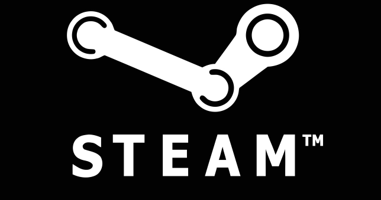

# Hybrid Recommendation Engine for Steam Games
A hybrid recommender using LightFM for games on the Steam platform

____
# Background

### Steam

Steam is a digital video game distribution platform where members buy, download, and launch games all through a single application. The service recently hit an all-time record high number of concurrent users online at 25 million [(source)](https://www.gamesindustry.biz/articles/2020-12-14-steam-breaks-concurrent-users-record-at-nearly-25m).

### Video Game Industry

At the moment, the video game industry is surging, with global video game revenue expected to reach $180 billion in 2020.

Due in large part to the Covid-19 pandemic, revenues from video games are expected to exceed many other forms of entertainment through 2021. However, even prior to the pandemic there was strong evidence suggesting videogames was experiencing a great growth period. [(source)](https://www.marketwatch.com/story/videogames-are-a-bigger-industry-than-sports-and-movies-combined-thanks-to-the-pandemic-11608654990#:~:text=Global%20videogame%20revenue%20is%20expected,North%20American%20sports%20industries%20combined)

### Recommender Systems

Recommendation engines are commonplace in many kinds of companies, especially those on digital platforms with huge item and user databases. Recommenders are crucial for guiding customers toward new and interesting products they may eventually purchase.
  
Due to these factors and my personal interest in gaming, I wanted to collect Steam data and build my own recommendation system for Steam games.

